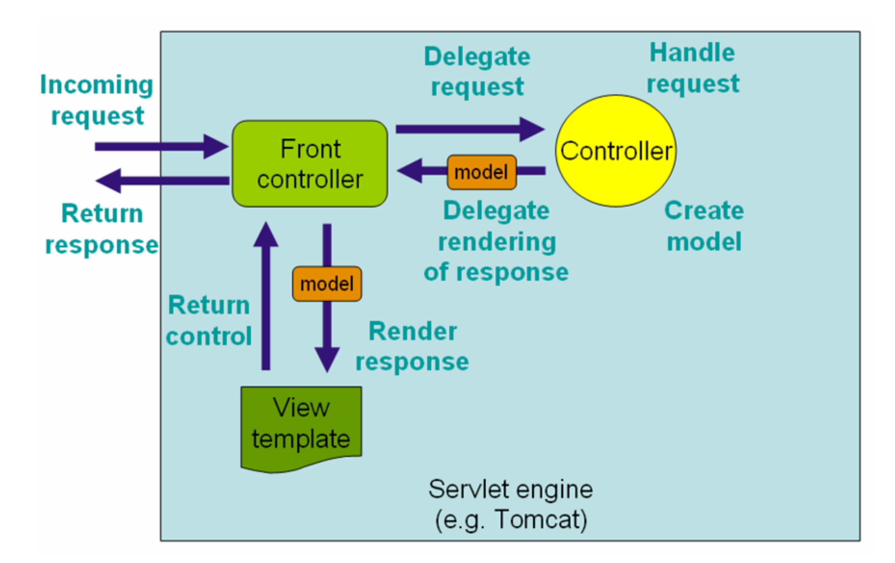

# Introduction to web apps with Spring Boot

**Note:** I had several problems trying to create the project from scratch without using Spring Initializr and using terminal. Since I didn't have any powerful Java IDE configured, I used the demo project for the next exercises. I will try to solve this problem in the following classes.

## [Web applications in Java can be deployed to stand-alone applications servers or embedded servers.Elaborate on when to choose one over the other (and relate with Spring Boot).](https://stephencoakley.com/2017/07/06/embedded-vs-external-web-server)

**Embedded servers** are web servers that run in the same process of the applications, without the need of extra installations and separation. The application starts the server and configures it.

On the other hand, **stand-alone applications servers** are web servers that runs separately from the applications and forwards requests to the application, might load the application and is configured by separate config files.

Embedded servers are useful to self-contain application, being able to have more control over how the web server behaves and, can be tested easily as a dependency of the application. It is also, usually, easier to deploy. Stand-alone appplications servers are easy to switch servers later on, the server isn't harmed by applications, can deploy apps updates without restarting and are better on HTTP performance and flexibily in the application architecture. So, usually, the choice is for the stand-alone applications servers when running multiple applications on a server and embedded servers when running one or two applications.

## [Explain, in brief, the “dynamics” of Model-View-Controller approach used in Spring Boot to serve web content. (You may exemplify with the context of the previous exercises.)](https://docs.spring.io/spring-framework/docs/3.2.x/spring-framework-reference/html/mvc.html)

Spring Boot uses the "dynamics" of MVC in the way that has controllers to handle request and create models with the data wanted. These models are used on the View templates in order to generate a visualization of the data. Spring's DispatcherServlet dispatches all the requests to the controllers and offers other functionality to help the development of web applications just like in the picture below.

In this particular case, there is a controller - MealController - that creates the model - Meal - that is used in the string template defined.

## [Inspect the POM.xml for the previous SpringBoot projects. What is the role of the “starters” dependencies?](https://www.baeldung.com/spring-boot-starters)
Spring Boot starters were to address the problem of dependency management in a complex project. Starter POMs are a set of convenient dependency descriptors that can be included in the application. It is a way to get all the Spring and related technology that it is needed, without having to hunt through sample code and copy-paste loads of dependency descriptors.

## [Which annotations are transitively included in the @SpringBootApplication?](https://docs.spring.io/spring-boot/docs/2.0.x/reference/html/using-boot-using-springbootapplication-annotation.html)
Spring Boot developers like having their apps to auto-configure themselves. That said, using @SpringBootApplication annotation is used to enable these three annotations:
 - @EnableAutoConfiguration: enable Spring Boot’s auto-configuration mechanism
 - @ComponentScan: enable @Component scan on the package where the application is located (see the best practices)
 - @Configuration: allow to register extra beans in the context or import additional configuration classes